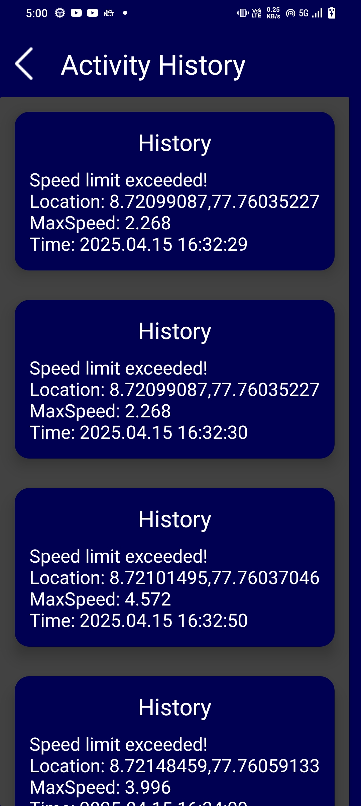

# android-project-Escort-

The "Real Time Speed Monitoring and Parental Alert" application is an Android-based solution developed using Java in Android Studio. This app is designed to ensure safe driving practices by continuously monitoring the real-time speed of a vehicle using the device's GPS. When the vehicle exceeds a predefined speed limit, the application automatically triggers an alert system that notifies the parent or guardian via email. This system is particularly useful for parents who want to ensure their teenagers are driving responsibly, enhancing both road safety and parental peace of mind.

SYSTEM IMPLEMENTATION

1. Android Studio & Java :

    The app is developed using Java in Android Studio, which provides the necessary tools and  
    environment for Android app development.

2. GPS Location Tracking :

    The app uses the device's GPS to track the user’s real-time location and calculate the current 
    speed.

3. Speed Monitoring Logic :

    A predefined speed limit is set in the app (e.g., 60 km/h).The app continuously compares the 
    current speed with this limit.
   
5. Alert Message System :

    If the speed exceeds the limit, the app sends an Message alert to a predefined  
    parent/guardian Phone number.

6. User Interface (UI) :

    The app includes a simple UI where the speed can be displayed and the parent’s email and 
    speed limit can be configured.

7. Permissions :

    The app requests necessary permissions such as ACCESS_FINE_LOCATION, INTERNET, 
    and FOREGROUND_SERVICE.
   
PROBLEM STATEMENT

Speeding among young drivers remains a critical issue in road safety. According to traffic safety statistics, young drivers are more likely to engage in high-risk behaviors, including speeding, due to their inexperience and a lack of awareness about the dangers of excessive speed. Traditional driving education, while helpful, often fails to address this issue comprehensively. Although modern vehicles come equipped with speedometers and other monitoring systems, there is no real-time, automated mechanism to alert parents if their child is exceeding safe driving limits. 

Screenshots:

